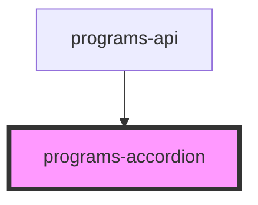

# programs-accordion

<!-- Auto Generated Below -->

## Properties

| Property  | Attribute | Description | Type     | Default     |
| --------- | --------- | ----------- | -------- | ----------- |
| `color`   | `color`   |             | `string` | `undefined` |
| `program` | `program` |             | `any`    | `undefined` |

## Dependencies

### Used by

 - [programs-api](../programs-api)

### Graph

----------------------------------------------

*Built with [StencilJS](https://stenciljs.com/)*
