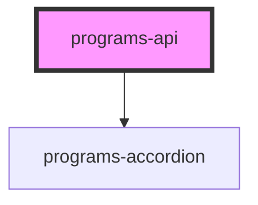

# programs-api

<!-- Auto Generated Below -->

## Properties

| Property       | Attribute      | Description | Type     | Default     |
| -------------- | -------------- | ----------- | -------- | ----------- |
| `color`        | `color`        |             | `string` | `undefined` |
| `organization` | `organization` |             | `string` | `undefined` |

## Dependencies

### Depends on

- [programs-accordion](../programs-accordion)

### Graph

----------------------------------------------

*Built with [StencilJS](https://stenciljs.com/)*
