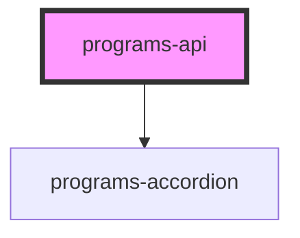

# programs-api

<!-- Auto Generated Below -->

## Properties

| Property             | Attribute            | Description | Type     | Default     |
| -------------------- | -------------------- | ----------- | -------- | ----------- |
| `checkbox_color`     | `checkbox_color`     |             | `string` | `undefined` |
| `color`              | `color`              |             | `string` | `undefined` |
| `enrol_button_color` | `enrol_button_color` |             | `string` | `undefined` |
| `organization_id`    | `organization_id`    |             | `string` | `undefined` |
| `organization_name`  | `organization_name`  |             | `string` | `""`        |
| `programs_height`    | `programs_height`    |             | `string` | `undefined` |

## Dependencies

### Depends on

- [programs-accordion](../programs-accordion)

### Graph

----------------------------------------------

*Built with [StencilJS](https://stenciljs.com/)*
